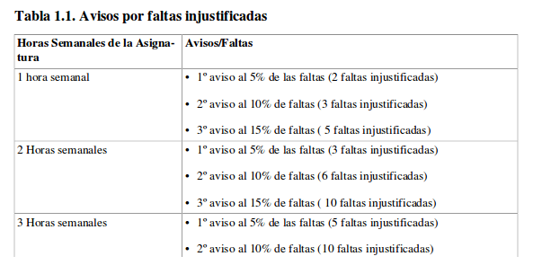
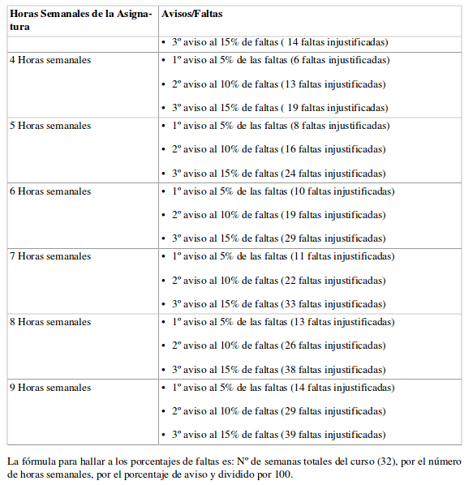

[<< back](README.md)

# Bajas, pérdida de evaluación contínua, y promoción.

## Orden de funcionamiento sobre las bajas de matrículas
**(OBLIGARIO LEER A LOS ALUMNOS POR ORDEN DE DIRECCIÓN)**

1. Excepcionalmente el alumnado menor con 16 años o más de edad, que esté matriculado en la enseñanza básica, puede causar baja voluntaria , siempre  que esta sea formalizada por su padre, madre o representante legal una vez hayan sido informados por el tutor o la tutora del grupo de la situación académica del alumno o alumna y de las consecuencias de la baja.

Todo el alumnado que finalice los estudios correspondientes a la educación básica sin obtener el título de Graduado o Graduada en Educación Secundaria Obligatoria recibirá un certificado oficial de estudios obligatorios por parte del centro educativo en el que haya estado matriculado el ultimo curso escolar, según el modelo establecido.

2. En las etapas obligatorias, los centros gestionarán la baja de oficio de matrícula del alumnado absentista, siempre que quede constancia tanto de que se han aplicado sus protocolos de atuación en materia de absentismo escolar, incluyendo la comunicación a los servicios municipales y a la Inspección Educativa, como intento, sin efecto, de la comunicación previa de las familias.

3. Si una vez iniciadas las actividades lectivas en las enseñanzas no obligatorias se observase la no incorporación de determinado alumnado, o su inasistencia continuada durante diez días lectivos o de forma discontinua por un período de veinticinco días lectivos, el equipo directivo se dirigirá a los interesados a fin de conocer las razones de idcho absentismo y procederá a realizar una baja de oficio y a admitir, a su vez, en matrícula a aquel alumnado que estuviera en lista de reserva, hasta completar el cupo asignado al grupo . Con carácter general, este procedimiento se desarrollará durante el primer trimestre del curso.

Transcurrido el citado plazo, durante el resto del curso académico, solo podrá realizarse baja de oficio de la matrícula cuando el alumnado no asista injustificadamente a clase de forma continuada por un período superior a veincinco días lectivos o de forma discontinua por un período superior a treinta y cinco días lectivos. A tales efectos, deberá quedar constancia fehaciente de la comunicación  al alumnado de tal circunstancia administrativa en la secretaría del centro.

4. Por otra parte, podrá incorporarse nuevo alumnado queno esté escolarizado o que no haya obtenido plaza en el período de preinscripción para ese curso, en cualquiera de los niveles o etapas de las enseñanzas postobligatorias que oferte un centro, simpre que queden plazas suficientes y con la fecha límite del día anterior al comienzo del período de preinscripción para la solicitud de plaza del curso siguiente.

---

## Normativa sobre la evaluación contínua

Avisos previos a la pérdida del derecho de la evaluación contínua.

---
## Módulos imprescindibles

Cuestiones sobre el acceso a la FCT e Integración, de especial interés para el alumnado de 2º curso.

Los tutores deben informar sobre la normativa en vigor y los módulos imprescindibles.

En reunión Departamento Informática 31 Marzo 2014, se especifican los módulos imprescindibles de para informática. Son los siguientes:
* CFGS DAW:
    * DEW (Desarrollo en el lado cliente)
    * DSW (Desarrollo web en el lado del servidor).
* CFGS ASIR:
    * SGY (Seguridad y Alta disponibilidad)
    * ADD (Sistemas operativos) y
    * SRD (Servicios de red).
