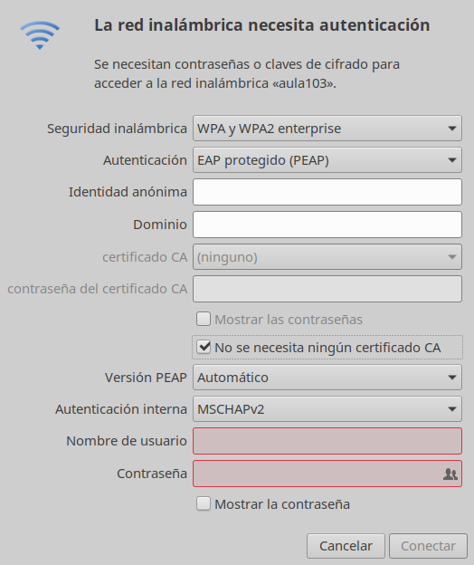

[<< back](README.md)

# FreeRadius

* [Servidor FreeRadius](#servidor-freeradius)
* [Puntos de acceso](#puntos-de-acceso)
* [Usuarios](#usuarios)
* [Configurar PC](#configurar-pc)

## Servidor FreeRadius

Los archivos de configuración del servicio *FreeRadius* se encuentran en *Leela* bajo la ruta `/etc/freeradius`

> Ojo porque en esta carpeta ni siquiera se puede navegar con un usuario "ordinario". Habría que hacer un `sudo -s` para poder acceder a ella, o bien ejecutar hasta los `cd` con `sudo`.

## Puntos de acceso

* El **modelo de punto de acceso** WIFI que estamos usando para el servicio Radius es: [TP-Link TL-WA901ND](https://www.tp-link.com/es/home-networking/access-point/tl-wa901nd/).
* Valores por defecto del punto del acceso (*o bien reseteando*):
    * IP por defecto: 192.168.0.254
    * Usuario/Password por defecto: `admin/admin`
* El punto de acceso se debería configurar con los siguientes parámetros para un correcto funcionamiento con el servicio *Radius*:

Sección **WPS**:

Parámetro | Valor
--- | ---
*WPS Status* | Disabled

Sección **Network**:

Parámetro | Valor
--- | ---
*LAN > Type* | Static IP
*LAN > IP Address* | :eyeglasses: Ver valores en tabla inferior
*LAN > Subnet Mask* | 255.240.0.0 (/12) [Enlace a cálculo de máscara](https://www.aprendaredes.com/cgi-bin/ipcalc/ipcalc_cgi?host=172.16.0.0&mask1=12&mask2=)
*LAN > Gateway* | 172.20.0.1
*DHCP Setings > DHCP Server* | Disable

Sección **Wireless**

Parámetro | Valor
--- | ---
*Wireless settings > Wireless Network Name (SSID)* | :eyeglasses: Ver valores en tabla inferior
*Wireless Security* | WPA/WPA2 - Enterprise
*Wireless Security > Radius Server IP* | 172.20.1.2
*Wireless Security > Radius Password* | :lock: Ver en [Bitwarden](https://vault.bitwarden.com)

Sección **System Tools**:

Parámetro | Valor
--- | ---
*Usuario* | :lock: Ver en [Bitwarden](https://vault.bitwarden.com)
*Password* | :lock: Ver en [Bitwarden](https://vault.bitwarden.com)

* La configuración de los puntos de acceso (*clientes* en terminología Radius) se realiza en el fichero: `/etc/freeradius/client.conf`.
* Aunque este fichero es bastante extenso lo importante son las secciones finales donde se definen los puntos de acceso que se utilizarán para la autenticación. Por cada punto de acceso habría que definir una sección como la siguiente:
~~~
client <ip_del_punto_de_acceso> {
	secret = <clave_para_validar_con_radius>
	shortname = <nombre_corto_de_identificacion>
}
~~~
* Los puntos de acceso configurados hasta el momento son:

Ubicación | IP | Nombre corto/SSID | MAC
--- | --- | --- | --- |
Aula 103 | 172.18.0.2* | aula103 | 68-FF-7B-0F-3C-A8
Aula 109 | 172.19.0.2 | aula109 | 0C-80-63-D7-1E-52

> Debería ser la 172.13.0.2 pero aún no se ha hecho la migración de la red del aula 103 y tiene el direccionamiento antiguo (del aula 108).

## Usuarios

* La configuración de los posibles usuarios se realiza en el fichero  `/etc/freeradius/users`.
* Este fichero tiene tantas líneas como usuarios queramos habilitar para el servicio *Radius* y cada línea tiene el formato siguiente:
`<usuario> Cleartext-Password := <contraseña>`
* El esquema de credenciales para las cuentas de usuario es el siguiente:

. | Usuario | Contraseña
--- | --- | ---
**Profesorado** | `<DNI>` (con letra mayúscula) | `<correo electrónico>`
**Alumnado** | `alu<num_expediente>` | `<CIAL>`

> El CIAL es el primer número que aparece en la esquina superior izquierda de la tarjeta del alumnado. El número de expediente es el número que está justo debajo del CIAL y que suele tener 4 dígitos.
* Los datos de alumnado en este formato se pueden obtener a través de TIFON.

**OJO**: Después de modificar los ficheros de configuración de FreeRadius no olvidarse de recargar la configuración con el siguiente comando:

~~~console
leela:~ sudo systemctl reload freeradius
~~~

---
# Configurar PC

Para configurar los PC's para acceder a la red Wifi de Freeradius hay los siguientes valores:

| Parámetro               | Valor                   |
| ----------------------- | ----------------------- |
| Seguridad               | WPA2 Enterprise         |
| Autenticación           | EAP (Protegido PEAP)    |
| Se necesita certificado | NO                      |
| Autenticación interna   | EAP-MSCHAP-v2           |
| Usuario                 | Usuario de Pincel/Ekade |
| Contraseña              | Clave de Pincel/Ekade   |

